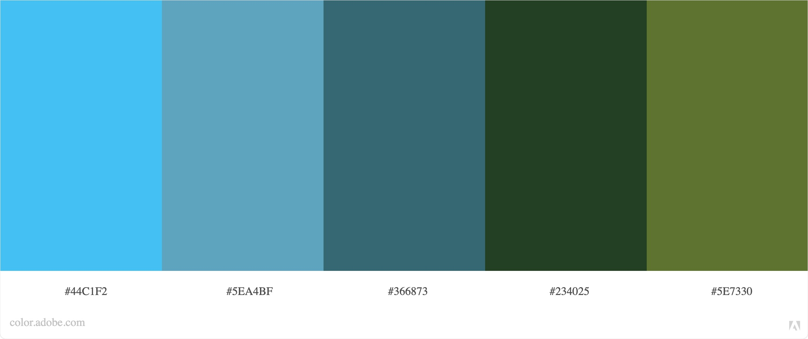

# **How to live during Pandemic in Dublin**

(Mokeup image)

## **Goal for this project** 

Our life has changed quite a lot due to Coronavirus was spreaded all around the world. 
Since We are having this new way of life We had to face different systems trying to provide clear information about our situation and actual restrictions.
Sometimes the Government's pages contain too much details and it's hard to find out the exact information we need.
On this site We summed up all relevant information in a simple and clear way to make it understandable easily for You!
We also collected a few ideas How to keep your physical and mental health during the Pandemic.
Our goal is to help your everyday life so do not hesitate to make your questions through our form!

---

## **UX**

### **User Goals**

* A website filled with useful and understandable content from official sources
* Provide access to official sources
* Easy and clear navigation sections
* Website should be easy to use on desktop, tablet & mobile
* Appealing visual elements
* Design what does not make anyone anxious as it is a tense topic 
* Form to make any question related to the topic

### **User Stories**

* As a user, I want to read the essence of related data in this topic.
* As a user, I want to be able to check easily if the information is official.
* As a user, I want to use a simple navigation on the site.
* As a user, I want to feel calm reading about this tense topic.
* As a user, I want to get advices how I can keep my general health during pandemic.
* As a user, I want to see a nice and simple design.
* As a user, I want to have a from to make my own questions.
* As a user, I want to see my local options for testing.
* As a user, I want to read about how I can help to end this situation.
* As a user, I want to read actual information.
* As a user, I want to be able to use the site on different devices.

### **Site owners Goals**

* Provide useful information about actual restrictions in a handy way
* Help to people stay heathy

### **User Requirements and Expectations**

#### Requirements

* Easy to navigate by using the navigation menu
* Relevant content about the actual restrictions 
* Information provided by official sources
* Doable advices for keeping health
* Comprehensive information about the situation
* Easy way to contact 
* Easy access to official sources

#### Expectations

* When clicking on links, I expect the page opening in a new tab
* I expect feedback when submitting the question form that the form has been submitted correctly
* I expect that the navigation links work properly so that is takes me wherever I want to go
* Clear information about actual restrictions and opportunities

### **Design Choices**

Nowadays all news are about the Coronavirus. It might be exhausting for many of us to see the potential danger everywhere associated with a strong yellow color.
In my design choices I am trying to avoid this visual anxiety and to create a harmonic ambience for the user.
I have used [Coolors](https://coolors.co/) and [Adobe Color](https://color.adobe.com/) to come up with a harmonic color scheme.

#### Fonts

#### Icons

#### Colors

As mentioned before, I am trying to create a harmonic ambience for the user with natural but lively colors.

* #44C1F2:
* #5EA4BF:
* #366873:
* #234025:
* #5E7330:

#### Structure

I have chosen to use [Bootstrap](https://getbootstrap.com/) to create an overall structure for my website. 
Bootstrap provides various elements of CSS and Javascript which is very helpful to keep a good structure on your page. 
As Bootstrap is designed for mobile first, I will be certain that my website functions well on mobile.

--- 

## **Wireframes**

I have decided to use [Balsamic](https://balsamiq.com/wireframes/) to create wireframes for my website. 
First I created a basic wireframe for desktop and later on for tablet and mobile. 
For my website I have decided to use a 5 paged structure that provides a well organiyed output.
The website will be easy to navigate by using the navigation bar and the fixed clickable list on the left side.

You can find my wireframes below:

### [Desktop Wireframe](wireframes/desktop-wireframe.pdf)

### [Tablet Wireframe](wireframes/)

### [Mobile Wireframe](wireframes/)